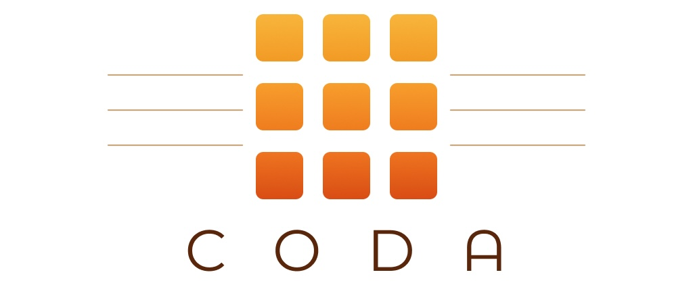
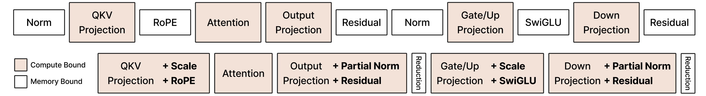

# CODA: GPU Kernels as GEMM-plus-Epilogue Programs

<p align="center">
  
</p>

<p align="center">
  <a href="https://arxiv.org/abs/2605.19269"></a>
</p>

**CODA** is a GPU kernel abstraction that expresses Transformer operators as GEMM-plus-epilogue programs, fusing normalization, activations, residual updates, and reductions into the GEMM output tile before it is written to global memory, combining framework-level productivity with hardware-level efficiency. CODA is built on [CUTLASS CuTeDSL](https://github.com/NVIDIA/cutlass) and targets NVIDIA Hopper (H100) GPUs.

<p align="center">
  
</p>


## Updates
- June 23, 2026. We are restructuring CODA. For legacy version, please check `v1` tag.

## Installation

```bash
git clone https://github.com/HanGuo97/coda-kernels.git
cd coda-kernels
pip install -e .
```


## Functional level


### `coda.kernels.functional.swiglu.linear_swiglu`

Fused linear projection and SwiGLU activation: `swiglu(x @ weight.T)`, where the projection produces a `gate || up` pre-activation and `swiglu(gate || up) = silu(gate) * up`.

| Argument | Shape | Description |
|----------|-------|-------------|
| `x` | `(M, K)` | Input activations. |
| `weight` | `(N, K)` | Gate+up projection weight (`out_features, in_features`); `N` must be even. |
| **Returns** | `(M, N // 2)` | SwiGLU output; differentiable in both `x` and `weight`. |

### `coda.core.gemm.functional.gemm`

Autotuned matrix multiply `A @ B`, dispatching between the quack and cuBLAS backends.

| Argument | Shape | Description |
|----------|-------|-------------|
| `A` | `(M, K)` | Left operand. |
| `B` | `(K, N)` | Right operand. |
| **Returns** | `(M, N)` | The product `A @ B`. |

### `coda.core.gemm.functional.gemm_swiglu`

GEMM fused with a SwiGLU activation: computes the `gate || up` pre-activation `A @ B`, then `swiglu(gate || up) = silu(gate) * up`, returning both.

| Argument | Shape | Description |
|----------|-------|-------------|
| `A` | `(M, K)` | Left operand. |
| `B` | `(K, N)` | Right operand; `N` must be even. |
| **Returns** `pre_act` | `(M, N)` | The `gate \|\| up` pre-activation, `A @ B`. |
| **Returns** `post_act` | `(M, N // 2)` | SwiGLU output, `silu(gate) * up`. |

### `coda.core.elementwise.functional.dswiglu_backward`

Backward pass of SwiGLU: given the pre-activation and the gradient w.r.t. the SwiGLU output, returns the gradient w.r.t. the `gate || up` pre-activation.

| Argument | Shape | Description |
|----------|-------|-------------|
| `pre_act` | `(M, N)` | The `gate \|\| up` pre-activation; `bf16`/`fp16`, contiguous. |
| `grad_out` | `(M, N // 2)` | Gradient w.r.t. the SwiGLU output; same dtype as `pre_act`, contiguous. |
| **Returns** | `(M, N)` | Gradient w.r.t. the pre-activation. |
